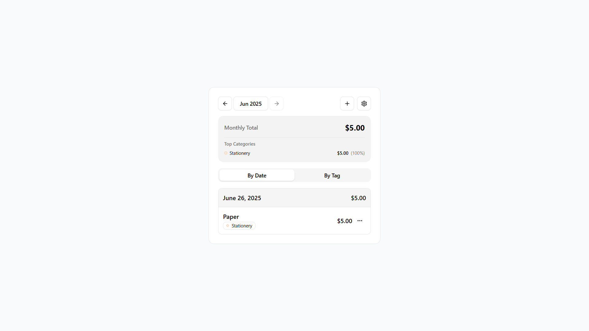

# Spendly

Spendly is a simple and minimal expense tracker. Users can add expenses with custom tags and dates, and view their spending grouped by date or tag. Built with React, TailwindCSS, Zustand, and Shadcn UI, Spendly offers a lightweight and customizable experience.

## Table of Contents

- [Introduction](#introduction)
- [Features](#features)
- [Tech Stack](#tech-stack)
- [How to Run](#how-to-run)
- [Screenshots](#screenshots)
- [Live Demo](#live-demo)
- [Contributing](#contributing)
- [License](#license)

## Introduction

Spendly is designed for users who want a quick and focused way to track their expenses without the clutter of full-featured finance apps. Whether you're managing daily purchases or categorizing expenses by tags, Spendly keeps things intuitive and clean.

## Features

- Add expenses with tags and dates
- Group and view expenses by date or tag
- Minimal, responsive UI
- Basic customization options for themes or preferences
- Fast and reactive experience using Zustand and Shadcn components

## Tech Stack

- **Frontend**: React, TailwindCSS, ShadCN UI
- **State Management**: Zustand

## How to Run

1. Clone the repository:

   ```bash
   git clone https://github.com/sansalgo/spendly.git
   cd spendly
   ```

2. Install dependencies:

   ```bash
   bun install
   ```

3. Run the development server:

   ```bash
   bun run dev
   ```

4. Open your browser and go to:

   ```
   http://localhost:5173
   ```

## Screenshots



## Live Demo

Try the app here: [Spendly Live Demo](https://spendly0.netlify.app/)

## Contributing

Contributions are welcome! If you have suggestions, bug reports, or feature requests, feel free to open an issue or pull request.

## License

This project is licensed under the MIT License – see the [LICENSE](LICENSE) file for details.
